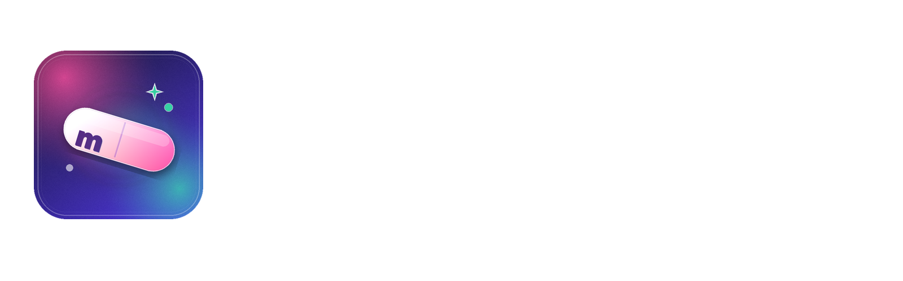
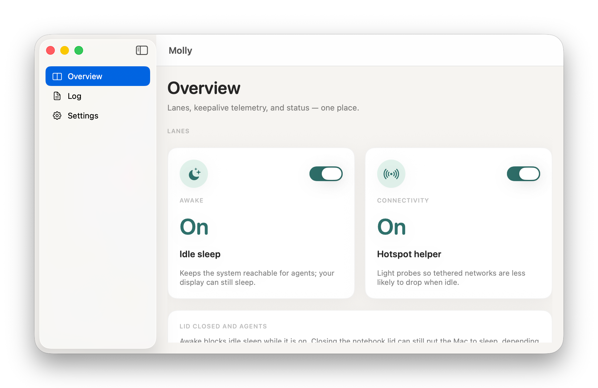
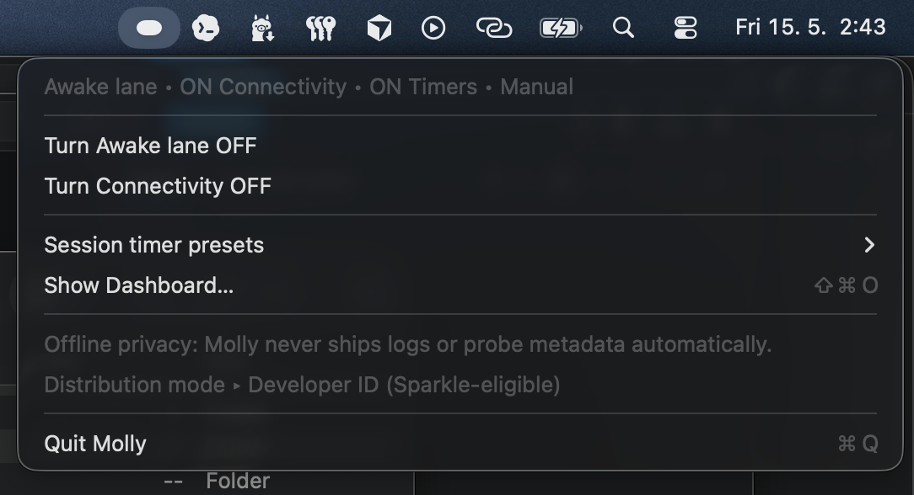
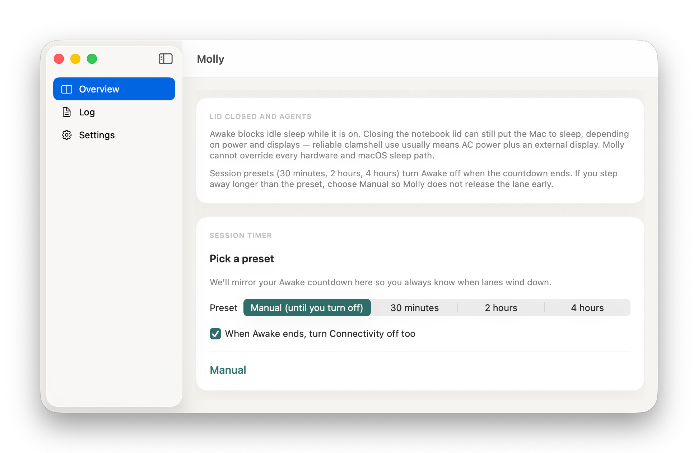

<p align="center">
  <picture>
    <source media="(prefers-color-scheme: dark)" srcset="docs/molly_logo_lockup_dark.png">
    
  </picture>
</p>

<p align="center">
  <strong>Keep your Mac awake. Without the rave-poster energy.</strong>
</p>

<p align="center">
  
  
  
  
</p>

<p align="center">
  <a href="https://github.com/jakubsejkora/molly/releases/latest">
    
  </a>
  <br>
  <sub>Apple Silicon · macOS 14 Sonoma or later</sub>
</p>

---

## Two lanes, one tiny menu bar

<table>
  <thead>
    <tr>
      <th align="center" width="33%">
        <br>Awake
      </th>
      <th align="center" width="33%">
        <br>Connectivity
      </th>
      <th align="center" width="33%">
        <br>Smart timer
      </th>
    </tr>
  </thead>
  <tbody>
    <tr>
      <td align="center">Holds an IOPower assertion so long agent jobs survive lid-closed naps — display still sleeps.</td>
      <td align="center">Jittered TCP and HTTPS probes nudge the radio so idle hotspots stop ghosting you.</td>
      <td align="center">30 m / 2 h / 4 h / custom auto-off, with optional mirror so both lanes stop together.</td>
    </tr>
  </tbody>
</table>

## See it

<p align="center">
  
</p>

<table>
  <tr>
    <td align="center" width="50%" valign="top">
      <br>
      <sub><b>Menu bar.</b> Toggle lanes, pick a timer preset, hop to the dashboard.</sub>
    </td>
    <td align="center" width="50%" valign="top">
      <br>
      <sub><b>Session timer.</b> 30 m / 2 h / 4 h / manual, with an optional mirror toggle.</sub>
    </td>
  </tr>
</table>

## Quick start

1. Download `Molly-0.4.1-arm64.dmg` from [Releases](https://github.com/jakubsejkora/molly/releases/latest).
2. Open the DMG and drag **Molly** into `/Applications`.
3. **First launch:** right-click `Molly.app` → **Open** → **Open** again. (See below.)

## First run on macOS

> **Heads up — this 0.4 build is not Developer ID signed.** macOS Gatekeeper will refuse to open it on the first attempt. This is a known and temporary trade-off for the preview release.

- Right-click `Molly.app` in `/Applications` → **Open** → **Open** in the dialog that appears.
- After that first launch, Molly opens normally from Spotlight, Launchpad, or `open -a Molly`.
- Signed and notarized builds will arrive in a later release.

## How it works

Molly runs two independent state machines in a single menu bar process. The **Awake** lane uses `IOPowerAssertions` plus `ProcessInfo.performExpiringActivity` to suppress idle-class sleep while letting the display nap. The **Connectivity** lane fires jittered gateway TCP and HTTPS `HEAD` probes on a ~120 s cycle (±25 % jitter) to trim idle hotspot disconnects — best effort, never magic.

## Build from source

<details>
<summary><b>Show build steps (XcodeGen flow)</b></summary>

Requires Xcode 15+, macOS 14+, an Apple Silicon Mac.

```bash
brew install xcodegen
xcodegen generate
open Molly.xcodeproj
```

Pick the **Molly** scheme and hit Run. Release builds are pinned to `arm64`; Debug follows the active architecture.

To package a `.dmg` from a local build:

```bash
./Scripts/package-dmg-arm64.sh
# → dist/Molly-0.4.1-arm64.dmg
```

For Developer ID signing + notarization see [`docs/RELEASE.md`](docs/RELEASE.md).

</details>

## Links

- Full v1 feature spec: [`spec/molly-v1-frozen-spec.md`](spec/molly-v1-frozen-spec.md)
- Brand kit: [`molly_branding/`](molly_branding/)
- Issues & ideas: [GitHub Issues](https://github.com/jakubsejkora/molly/issues)

---

<sub><b>Heat note:</b> keep your Mac on a ventilated surface during closed-lid sessions — awake work makes warm work.</sub>

<sub>Released under the <a href="LICENSE">MIT License</a>. Molly is a personal project, not affiliated with Apple Inc.</sub>
